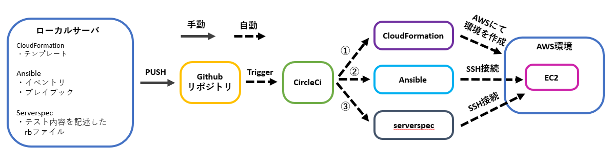
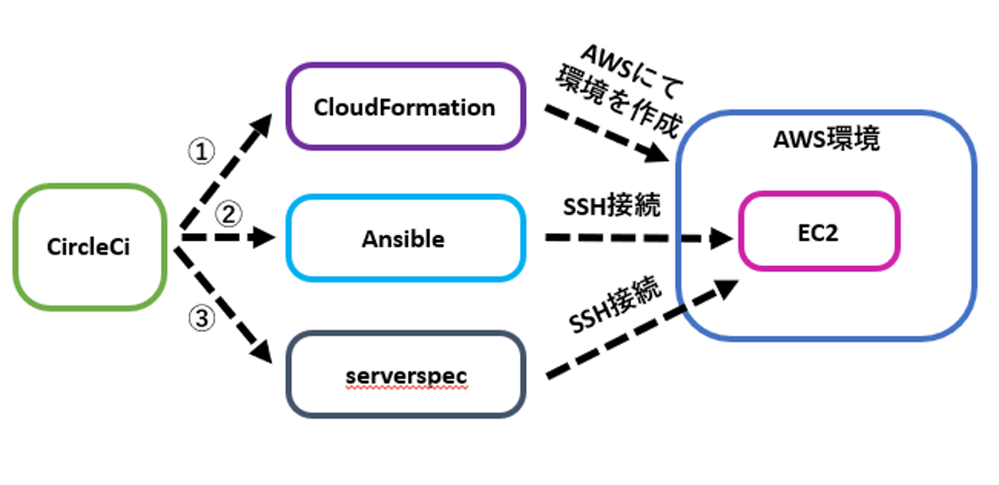

# 学習内容
## 構成図


## **概要**
- **CircleCIを用い構成図内①∼③を走らせ、AWS環境の構築・サーバ構築・アプリデプロイ・サーバテストを一連で自動実行**
- **①Create…CloudFormation(以降CFn)テンプレートを作成しVPC・EC2・RDS・ALB・S3のAWS環境を自動構築**
- **②Setup…Ansibleにてサーバの構成をコード化し、サーバ構築とアプリデプロイを自動化**
- **③Test…ServerSpecを用い②で構築したサーバに対し自動テスト**

<br>
<br>

# 再現手順

<details><summary>再現に必要なファイルとフォルダ構成</summary>

 ├─.circleci
 |　 └─config.yml
 |
 ├─ansible
 |  └─roles
 |     ├─01_yum
 |     |  ├─tasks
 |     |  |  └─main.yml
 |     |  ├─vars
 |     |  |  └─main.yml(変数を使用しない場合はvarsのフォルダごと削除)
 |     |  └─templates
 |     |     └─XXX.XXX(テンプレートを使用しない場合はtemplatesフォルダごと削除)
 |     |
 |  ～～～～
 |     ├─iventory
 |     └─playbook.yml
 |
 |
 ├─cloudformation
 |  ├─vpc.yml(自分が構成したいAWS環境のテンプレートを配置)
 | ～～～～
 |
 ├─serverspec
 |  ├─spec
 |  |  ├─3.112.229.42(自身のEC2のIPアドレスを記載)
 |  |  |  └─sample_spec.rb
 |  |  └─spec_helper.rb
 |  ├─.rspec
 |  ├─Gemfile
 |  ├─Gemfile.lock
 |  └─Rakefile
 |
 └─ansible.cfg

</details>

## 1.circleciの動作確認
- ①ユーザー登録でgithubアカウントと連携する
- ②Projectsをクリックし、連携させたいリポジトリを選択
- ③"Select a config.yml"と表示されたら、Fastを選択し、“Set Up Project”をクリック
- ④サンプル設定ファイルの"Hello World"を選択する
- ⑤CircleCIコンフィグエディタに、サンプルの`config.yml`が存在する。`Commit and Run`をクリックする。
- ⑥Successと書かれたコメントが表示されたら、circleci動作確認完了  
[公式のスタートガイドから抜粋](https://circleci.com/docs/ja/getting-started/)

<details><summary>circleci概要</summary>

## 概要
- CircleCiはCI/CDツールの1種である。  
- CI(継続的インティグレーション)とはアプリやインフラのソースコードのテストを自動化し、これを継続的に実行すること。
- CD(継続的デリバリー)とは各環境へのデプロイ作業を自動化し、これを継続的に実行すること。
- CircleCiはソースコードのバージョン管理ができるgithubと連携できる
- これらからソースコードのバージョン管理/テスト/各サーバーへのデプロイを自動で行えることで、開発に集中できる

</details>


<details><summary>configファイルとは</summary>

### configファイルについて
- CircleCiで行うことは.circleci/config.ymlに記載し、このファイル内容をCircleCiが実行する。
- 下記はcircleci/config.ymlの抜粋
- "version"とはCircleCIのバージョンのことである
- "orbs"とはCircleCIの機能や設定を利用するためのパッケージであり(orbs一覧は公式にて)、これによりconfigファイル内で特定の設定(jobを実行する環境)として利用できる。(上記config.ymlでは"circleci/python@2.0.3"という"orbs"を"python"と命名している。)
- "job"とはCircleCiで実行される単一のタスクで"step"の集合体であり、上記では"cfn-lint"と命名した"job"で"checkout","run"×2が"step"にあたる
- "executor"とは"job"の実行環境を指定するものであり、上記では"orbs"で"python"と命名した設定を呼び出している

<div>

```
version: 2.1

orbs:
  python: circleci/python@2.0.3

jobs:
  cfn-lint:
    executor: python/default
    steps:
      - checkout
      - run: pip install cfn-lint
      - run:
          name: run cfn-lint
          command: |
            cfn-lint -i W3002 -t cloudformation/*.yml
```

</div>
</details>

<details><summary>今回の用途</summary>

### 今回の用途
- AWS環境を自動構築(CloudFormation)、アプリデプロイのためEC2を自動環境設定(ansible)、EC2の環境設定を自動テスト(serverspec)、これらのソースコードをgithubへプッシュのみし一連で行うことを可能にする
- これで開発作業に集中できる環境を作る

</details>


<details><summary>circleciと他サービス連携で注意すること</summary>
### circleciと他サービス連携で注意すること
- 構成図の自動化は下記図の流れで実行される

- 注目は下図であり、circleciがcfn,Ansible,serverspecに指示を出し、それぞれを動かしている。
- つまりcircleciが仮想のサーバーとして指示を出すため、通常AWS使用の際に必要なパスワード,SSH接続時に必要なIPアドレスと秘密鍵等をcircleciに持たせることが必要(詳しくは手順の中で説明)
- ローカルからリポジトリへプッシュしたファイルの情報以外はcircleciが持っていないことを意識すること。

- またcircleciが仮想のサーバーとなりansibleを起動させEC2へ指示を出すことから、下記の関係性にも意識すること(ノードについての詳細はansibleの項目参照)


</details>


<details><summary>cfn-ansible-serverspec間で意識すること</summary>
### cfn-ansible-serverspec間で意識すること
- 図①～③の順で実行され、主にansible(EC2の環境設定)ではcfnで構築されたRDSやALBの情報を基にサンプルアプリの設定ファイルを書き換える。
- つまりCloudFormationで構築されたリソースで必要な情報であるRDSのエンドポイントやALBのDNS名はansibleに受け渡す必要がある(詳細は手順の中で説明)


</details>


<br>
<br>
<br>
<br>

## 2.CircleCiとCFn
- ③aws cliを使用するためのアクセスキーとシークレットアクセスキーを取得する。  
[アクセスキーの作成方法](https://acorn-blog.tech/aws-access-key/)  
- ④取得したキーとリージョンをcircleciの環境変数として設定する。("aws_access_key_id" "aws_secret_access_key" "region"をNameとして、取得したキーの値をValueに設定する)  
[CircleCiに環境変数を設定する方法](https://qiita.com/ashketcham/items/ea211040c841cbf81200) 
- circleciのconfigを下記①～④の手順で変更する[configファイルはこちらから](./.circleci/config.yml)
- ①Cfnテンプレートの格納場所を指定
```
# 「」をテンプレートが保存される場所を指定　*本構成から変更しないことを推奨
cfn-lint -i W3002 -t 「cloudformation/*.yml」
```
- ⑤使用したいCFnテンプレートを格納し、スタック名とファイル名を書き換える。[今回使用したテンプレートはこちら](./cloudformation)
```
#1つ目の「」をスタック名に変更
#2つ目の「」を使用するテンプレートに変更
 aws cloudformation deploy --stack-name 「lecture13-vpc」 --template-file 「cloudformation/vpc.yml」
```
- ⑥ansibleで“EC2のIPアドレス” “ALBのDNS名” “RDSのエンドポイント,ユーザー名,パスワード”が必要となるので、それぞれテキストファイルに記載しておく
```
#1つ目の「」を設定したスタック名に変更
#2つ目の「」をスタック内で何番目のoutput値を指定するか選択。但し1つ目のエクスポート値を0として数える。
#3つ目の「」にテキストファイル名を入れる。*本configでのテキストファイル名から変更しないことを推奨
 aws cloudformation describe-stacks --stack-name 「lecture13-EC2」 --query 'Stacks[].Outputs[「1」].OutputValue' --output text > /tmp/「AWS_EC2_HOST」.txt
```
- ⑦今回使用したDBのテンプレートはパラメータストアからRDSパスワードを設定しているので、下記にてパラメータストアから値を引っ張ってくる
```
#「」に引っ張ってきたいパラメータ名を入力する
 aws ssm get-parameters --query Parameters[].Value --output text --name 「RaiseTech-RDS-password1」 --with-decryption > /tmp/AWS_DB_PW.txt
```

<details><summary>概要</summary>
### 概要
- cfnはインフラを自動化するために必要なIaC(Infrastructure as code)を行えるAWSのサービス。
- IaC(Infrastructure as code)とはインフラをコード化すること。
- インフラ自動化のメリットは、手動構築と比較し工数が少ない/再現性が高い/バージョン管理が容易なことが挙げられる
- リソース構築内容を定義するファイルをテンプレートと呼び、複数のリソースの依存関係もテンプレートに記述される。
- テンプレートを利用しcfnによりプロビジョニングされたリソースの集合体をスタックと呼ぶ。

</details>


<details><summary>今回の用途</summary>
### 今回の用途
- VPC,EC2,RDS,ALB,S3でのAWS環境を自動構築する。

</details>


<details><summary>実行内容</summary>
- cfnで実行するjobはcfnテンプレートのコードチェックとデプロイ(circleci/configより抜粋)

<dev>

```
  cfn-lint:
    executor: python/default
    steps:
      - checkout
      - run: pip install cfn-lint
      - run:
          name: run cfn-lint
          command: |
            cfn-lint -i W3002 -t cloudformation/*.yml

  cfn-execute:
    executor: aws-cli/default
    steps:
      - checkout
      - aws-cli/setup:
          aws_access_key_id: AWS_ACCESS_KEY_ID
          aws_secret_access_key: AWS_SECRET_ACCESS_KEY
          region: AWS_DEFAULT_REGION
      - run:
          name: deploy Cloudformation
          command: |
            aws cloudformation deploy --stack-name lecture13-vpc --template-file cloudformation/vpc.yml
       　　　～～～～～～～～～～.
            aws cloudformation describe-stacks --stack-name lecture13-ALB --query 'Stacks[].Outputs[0].OutputValue' --output text > /tmp/AWS_ALB_HOST.txt
　　　　　　～～～～～～～～～～
            aws ssm get-parameters --query Parameters[].Value --output text --name RaiseTech-RDS-password1 --with-decryption > /tmp/AWS_DB_PW.txt
      - persist_to_workspace:
          root: /tmp
          paths: AWS*
```
</dev>
</details>


<details><summary>aws-cliについて</summary>
### aws cliについて
- 今回はaws cliというawsをコマンドラインで操作するためのツールをcircleci上で使用する。
- aws cliを使用するにはアクセスキーとシークレットアクセスキーが必要であり、事前に環境変数としてCircleCiに設定している(上記configではリージョンも事前に設定)  
- 下記部分の"："以降の文字列がconfig内の環境変数である

<dev>
```
aws_access_key_id: AWS_ACCESS_KEY_ID
aws_secret_access_key: AWS_SECRET_ACCESS_KEY
region: AWS_DEFAULT_REGION
```

</dev>
</details>


<br>
<br>
<br>
<br>


# 3.CircleCiとansible
- circleciのconfigを下記①～②の手順で変更する
- ①下記を先程設定したテキストファイル名を記載し変数として指定 *本configでのテキストファイル名から未変更の場合はスキップ
```
#「」内をテキストファイル名に変更
echo "export AWS_EC2_HOST=$(cat /tmp/「AWS_EC2_HOST」.txt)" >> $BASH_ENV
```
- ②下記にplaybookとinventoryの場所を指定する
```
#「」内に保存されている場所を指定
playbook: 「ansible/playbook.yml」
playbook-options: '-i 「ansible/inventory」'
```
- playbookを下記①～②の手順で変更する[playbookはこちらから](./.circleci/config.yml)
- ①rolesフォルダ内のフォルダ名を変更する場合はplaybook内下記箇所も変更すること
```
#01_yumのフォルダ名を変更する場合は「」内も変更する事
- { role: 「01_yum」, tags: yum }
```
- ②先程変数として指定した値をplaybook内で使用できるよう設定  *本configから変数名未変更の場合はスキップ
```
#「」内に先程設定した変数名を記載
aws_alb_host : "{{ (lookup('env','「AWS_ALB_HOST」')) }}"
```
- ③S3名をcircleciの環境変数として設定し、下記にてplaybook内で使用できるよう設定
```
aws_s3_bucket: "{{ (lookup('env','AWS_S3_BUCKET')) }}"
```
- tasks内にtask内容を記述したymlファイル、varsにtaskで使用する変数記述したymlファイルを格納
- iventoryを下記に変更する[inventoryはこちらから](./.circleci/inventory)
```
「」内にEC2のIPアドレスを記載する
[server]
「3.112.229.42」
```
- EC2へSSH接続のための秘密鍵をcircleciに設定  
[秘密鍵をcircleciに設定する方法](https://qiita.com/takuyama/items/4dfebb15bd9408dd92ee)
- ansible.cfgを作成し下記内容で保存
```
ssh_args = -C -o ControlMaster=auto -o ControlPersist=60s -o StrictHostKeyChecking=no
```

<details><summary>ansible概要</summary>
### 概要
- ansibleは構成管理ツールの1種である。
- 構成管理ツールとは管理対象サーバーの設定/構成ファイルをコードで定義し、定義内容と異なる場合は予め定義した設定/構成に変更するものである。(例えばrailsはversion 7.0.4と定義すると、異なるversionの場合は7.0.4に自動で変更する)
- これにより手動のコマンド操作でサーバを設定/構成することが不要、自動で何度行っても同じ設定/構成となる。
- 何度行っても設定/構成が同じになることを冪等性(べきとうせい)と呼ぶ。

</details>

<details><summary>ノードと必要ファイル</summary>

### ノードと必要ファイル
- コントロールノード(Control node)…………設定/構成ファイルを基に指示を出すサーバー
- 管理対象ノード(Managed node)…………コントロールノードから指示を受け、設定/構成ファイルを基に管理されるサーバー
- イベントリ(iventory)…………管理対象ノードを指定するファイル、IPアドレスを記載する。
- プレイブック(playbook)…………管理対象ノードに対する設定/構成を記述するファイル


</details>

<details><summary>playbook記載例</summary>

### playbook記載例
- モジュール(module)…………playbookを構成する最小単位のこと。例として管理ノード上で指定したシェルコマンドを実行するshellmodule、管理ノード上のサービスを制御するsystemdmodule等がある
- タスク(task)…………moduleのパラメーターに値を設定し実行可能となったもの。taskには固有のtask名を設定する
- プレイ(play)…………1つ以上のタスクを並べ、管理対象ノードと変数等を加えたものをプレイと呼ぶ。  
[playbookの基本](https://zenn.dev/y_mrok/books/ansible-no-tsukaikata/viewer/chapter8)
- Playbookの記述例を下記に示す

<div>

```
- name: Setup nginx server   　#play名
  hosts:  　#どのサーバーに対して実行するか。serversをイベントリファイルで定義
    - servers
  tasks:
    - name: check nginx install　 　#task名(タスク1)
  　　shell: bash -lc "nginx -v"  　#shellmoduleを使用しnignxがインストールされているか確認
  　　register: check_nginx_installed　　#タスク1の結果を"check_nginx_installed"と登録

　　- name: nginx install  #task名(タスク2)
  　　shell: bash -lc "amazon-linux-extras install -y nginx1"　　#shellmoduleを使用しnignxをインストール
  　　when: check_nginx_installed is failed　　#タスク1の結果である"check_nginx_installed"が"no"、つまりインストールされていない場合のみタスク2を行う

　　- name: start nginx #task名(タスク3)
  　　systemd:　　#systemdmoduleを使用しnignxを起動させている
    　　name: nginx
    　　state: started
```

</div>
</details>

<details><summary>inventory記載例</summary>
### inventory記載例
- 基本的には管理対象ノードを指定するファイルである
- その他定義をすることもでき、今回はSSH接続時のユーザーとrootユーザー権限を使用する場合の定義を追加
- その他詳細は下記  
[inventoryの基本](https://zenn.dev/y_mrok/books/ansible-no-tsukaikata/viewer/chapter5)
- 下記に今回のinventoryを示す

<div>

```
[server]
3.112.229.42　#接続するEC2のIPアドレス
[server:vars]
ansible_user=ec2-user　#SSH接続する際のユーザー
ansible_become_user=root  #ルート権限を使う際の定義。playbook内「become: yes」と入力することでルート権限できる。使用例は01_yum内のmain.yml参照
```

</div>
</details>


<details><summary>今回の用途</summary>

### 今回の用途
- cfnで作成したEC2を管理対象ノードとし、自動でアプリをデプロイできるよう設定する。

</details>

<details><summary>実行内容</summary>
### 実行内容
- ansibleで実行するjobはcfnでのエクスポート値の取込み、circleciサーバへansibleインストール、playbookの実行である(circleci/configより抜粋)
```
-   ansible-execute:
    executor: ansible/default
    steps:
      - checkout
      - attach_workspace:
          at: /tmp
      - run:
          name: set-env-vars
          command: |
            echo "export AWS_EC2_HOST=$(cat /tmp/AWS_EC2_HOST.txt)" >> $BASH_ENV
            ～～～～～～～～～～
      - ansible/install:
          version: 2.10.7
      - ansible/playbook:
          playbook: ansible/playbook.yml
          playbook-options: '-i ansible/inventory'
```

</details>

<details><summary>ローカルでの実行</summary>
### ローカルでの実行
- CircleCiからansibleを起動できる段階となったが、ローカルから管理対象ノードへ指示を出せるかを確認することをオススメする
- いきなりcircleciでansibleを実行すると、ansible側の問題かcircleci側の問題であるか分からなくなるため  
[ローカルからansible実行](https://qiita.com/tx2/items/ff8d27ff479754bbc4cc)

</details>

<br>
<br>
<br>
<br>


# 4.CircleCiとserverspec
- sample_spec.rbの内容をテストしたい内容に書き換える
- 3.112.229.42のフォルダ名をEC2のIPアドレスに変更する

<details><summary>概要</summary>
### 概要
- serverspecはテスト自動化ツールの1種である。
- テストコードはリソースタイプとマッチャーので記述される。
```
describe リソースタイプ(テスト対象) do
  it { マッチャー }
end
```

</details>

<details><summary>リソースタイプとマッチャー</summary>

- リソースタイプはテストする対象のリソースを指定、マッチャーはリソースへ期待する状態を指定する。以下一例
- 全てのリソースタイプは下記公式にて  
[公式(リソースタイプ)](https://serverspec.org/resource_types.html)


| リソースタイプ | 説明                                         |
|:--|:--|
| `command`      | コマンドの実行結果をテスト                   |
| `file`         | ファイルの存在,内容,権限等をテスト           |
| `package`      | 指定のパッケージのインストール有無をテスト |
| `port`         | 特定のポートがリスニング状態であるかをテスト         |
| `service`      | 指定のサービスが実行中であるかをテスト        |

| マッチャー      | 説明                                        |
|:--|:--|
| `contain`       | ファイルが指定の文字列を含む      |
| `be_installed`  | パッケージがインストールされていることを確認      |
| `be_running`    | サービスやプロセスが実行中であることを確認        |
| `be_enabled`    | サービスが有効化されていることを確認             |
| `be_listening`  | ポートがリスニング状態であることを確認            |
| `be_owned_by`   | ファイルが特定のユーザーに所有されていることを確認  |

</details>

<details><summary>今回の用途</summary>

### 1-4-2.今回の用途
- ansibleで設定したEC2が正しく環境設定できているか自動でテストする。

</details>

<details><summary>実行内容</summary>
### 実行内容
- serverspecで実行するjobは下記。serverspecのテストに必要な依存関係のインストール、テストの実行である(configファイルより抜粋)

<dev>
```
  serverspec-execute:
    executor: ruby/default
    steps:
      - checkout
      - ruby/install:
          version: '3.1.2'
      - ruby/install-deps:
          app-dir: serverspec
      - run:
          name: execute serverspec
          command: |
            cd serverspec
            bundle exec rake spec
```
</dev>
</details>


<details><summary>設定ファイルの入手方法と変更内容</summary>
## 5-2.serverspec設定ファイル
- 設定ファイルのネットからの入手方法は下記  
[serverspecでの設定ファイル入手方法](https://hitolog.blog/2021/10/14/serverspec/)
- しかしcircleciでの実行では"~/.ssh/config"での秘密鍵のパスを指定できないが、ansible実行時に事前に秘密鍵を登録しているので問題無し
- "~/.ssh/config"で設定できていない"User"と“HostName”は個々で設定する必要がある
- "User"はspec_helper.rb内の"user"の値を下記の様に書き換える

<dev>
```
require 'serverspec'
require 'net/ssh'

～～～～～～～～～～

options[:user] ||= "ec2-user"

～～～～～～～～～～
```
</dev>
- 上記リンク先に「Serverspecはテストを実行する時specディレクトリ配下のディレクトリをテスト対象サーバとします」とある。
- ここから“HostName”はspecディレクトリ配下のディレクトリ名をテスト対象サーバーのIPアドレスに書き換えることで解決する。  

# 実行結果
- ここまでで全ての準備は完了。実行結果は下記  
[実行結果](./lecture13.md)


## 学習記録はリンク先
[学習記録](./study-record.md)


