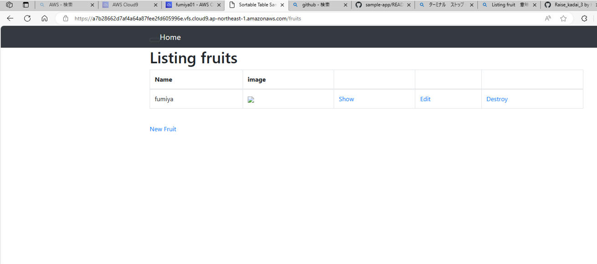
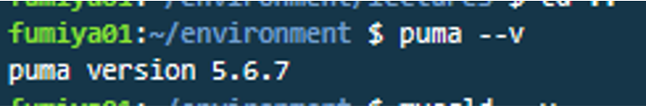
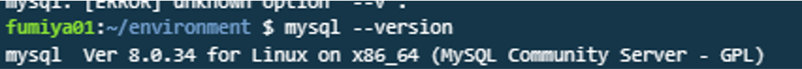
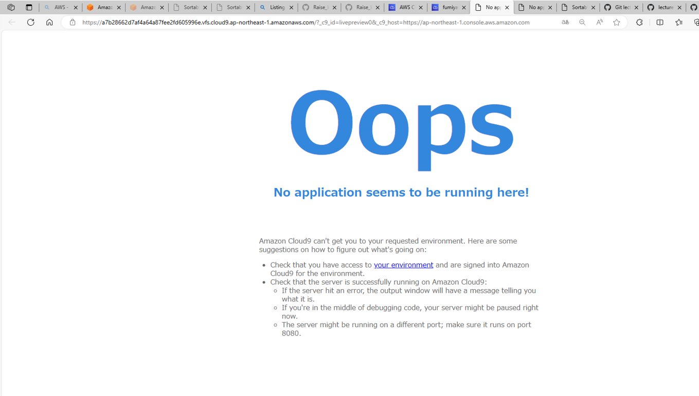
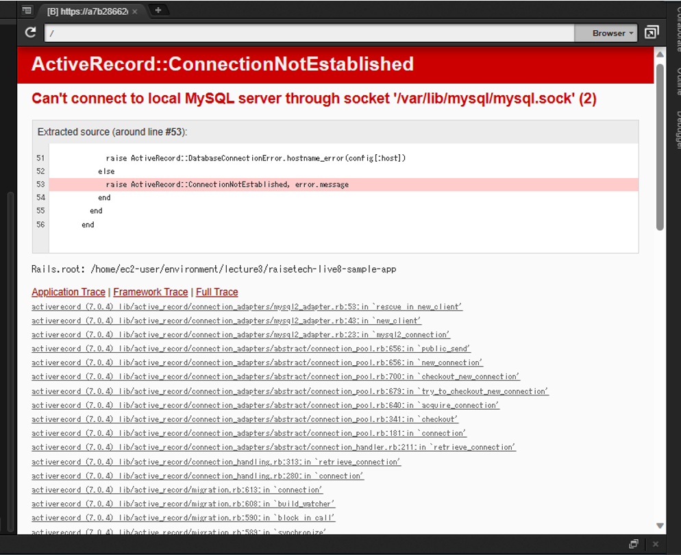

# 第3回課題提出
## アプリの起動確認

## AP/DBサーバについて
### 1.名前とバージョン
- APサーバ
- 名前:puma　バージョン:5.6.7

- DBサーバ
- 名前:mysql　バージョン:5.6.7

### 2.終了させた際のアクセス
- APサーバ

- DBサーバ

## Railsの構成管理ツール
- bundler

## - 今回の課題で学んだこと
- gemでの入れ方　例;gem install rails-バージョン
- バージョンを調べるコマンド　例;ruby --v
- 自力でサンプルアプリ対応verをinstallしたがクローンしたディレクトリでbundlerすればできた、bundler理解せず進めてしまった……
- nodeとyarnについて
- コマンド cdと少しlsについて
- configファイルとは
- パーミッションとその変更の仕方について
