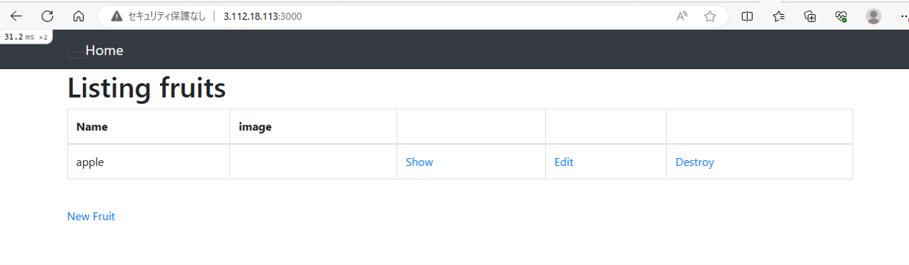
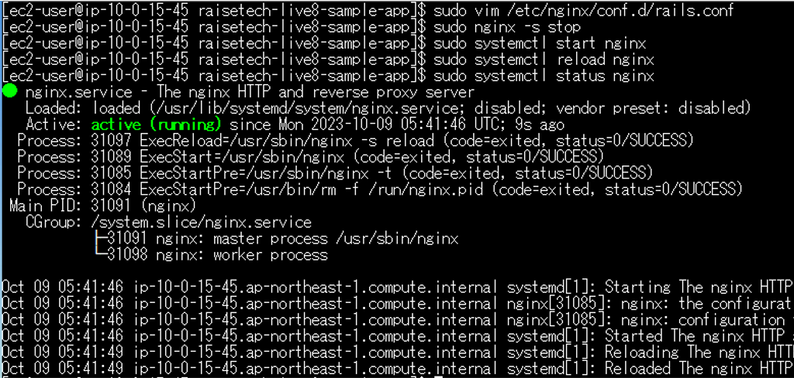
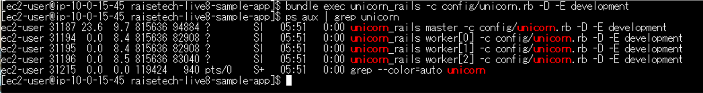
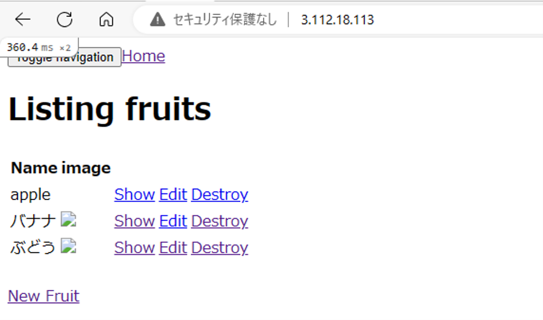
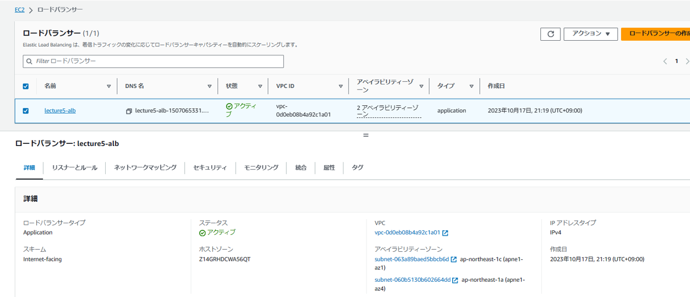
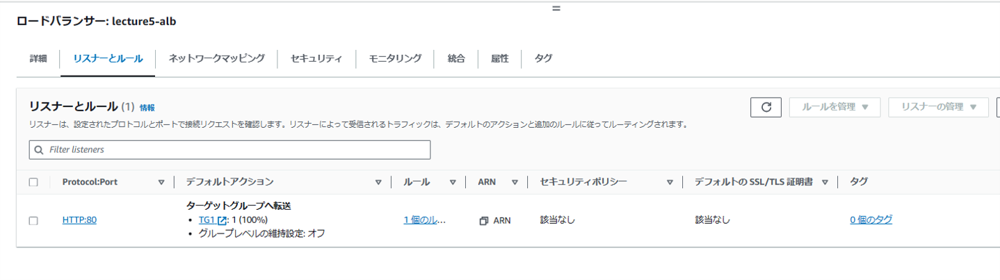
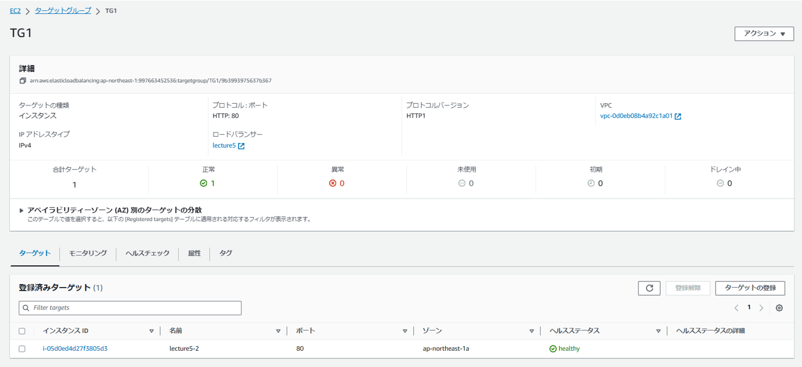
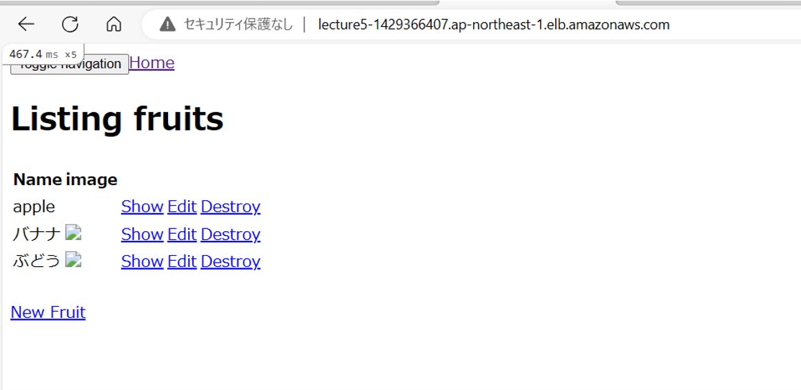
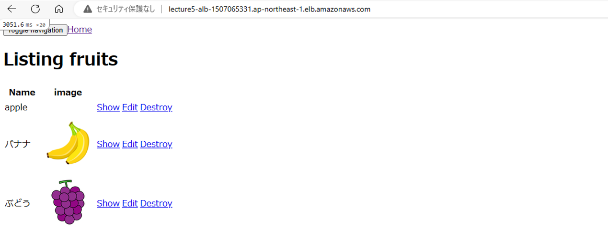
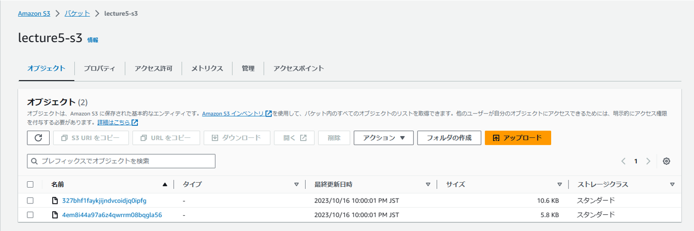

# 第5回課題提出
## EC2上でのアプリ動作確認
- 必要なパッケージをインストール
- サンプルアプリをクローン

### 組み込みサーバーでの動作確認
- bundle installで必要なパッケージをインストール
- bin/setupを完了させbin/devにてアプリ起動  

### nginxとunicornでの動作確認
- nginxをインストールし設定ファイルを編集する。(unicorn.sockが生成される場所と受け付けるポート番号に気を付ける)
- nginxの起動確認

- unicornがインストールされていることを確認し起動し確認する(どの環境で起動させるか注意する)

- 動作確認

## ALB追加し動作確認
- ALB作成

- DNSで入れるようにでdevelopment.rbで許可する
- 動作確認

## S3を追加し動作確認
- S3作成しEC2にS3用の権限を与える
- storage.ymlとdevelopment.rbを編集する
- 動作確認

## 感想
- 闇雲に設定ファイルを変えてはいけないことを学んだ
- 変更するなら元の設定ファイルを残しておく
- logを追いかけることを学んだ
- 自分の状況を進むごとに整理することを学んだ
- とても苦労した課題だった

