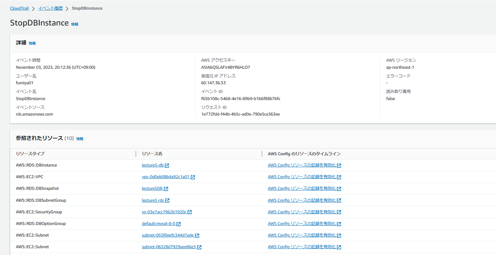
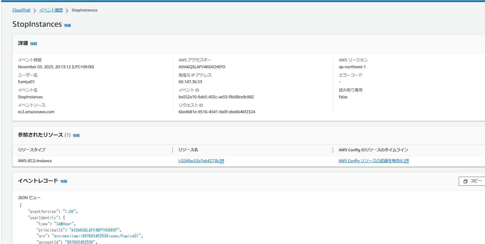
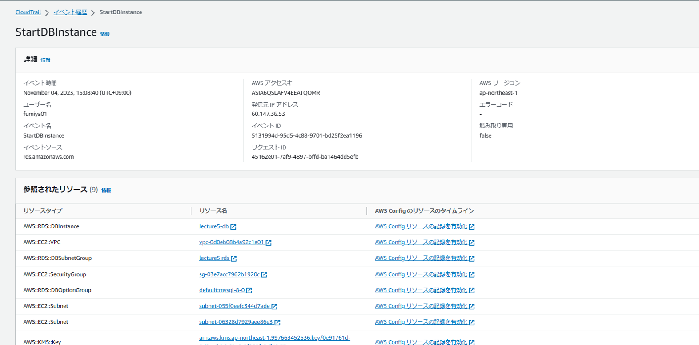
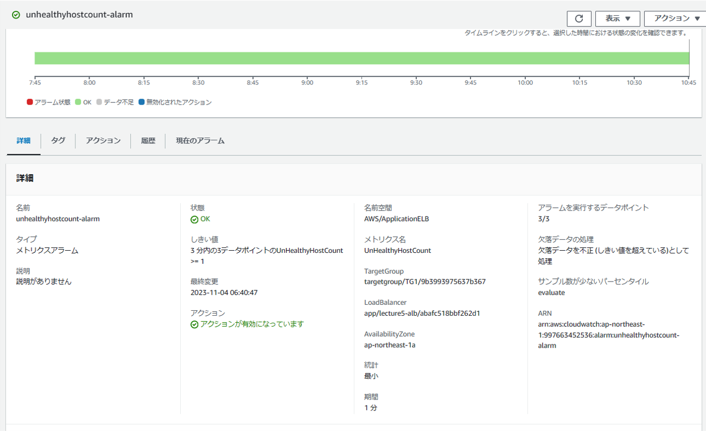
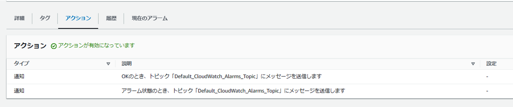
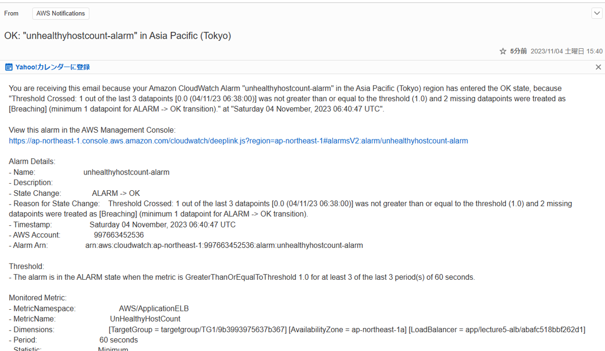
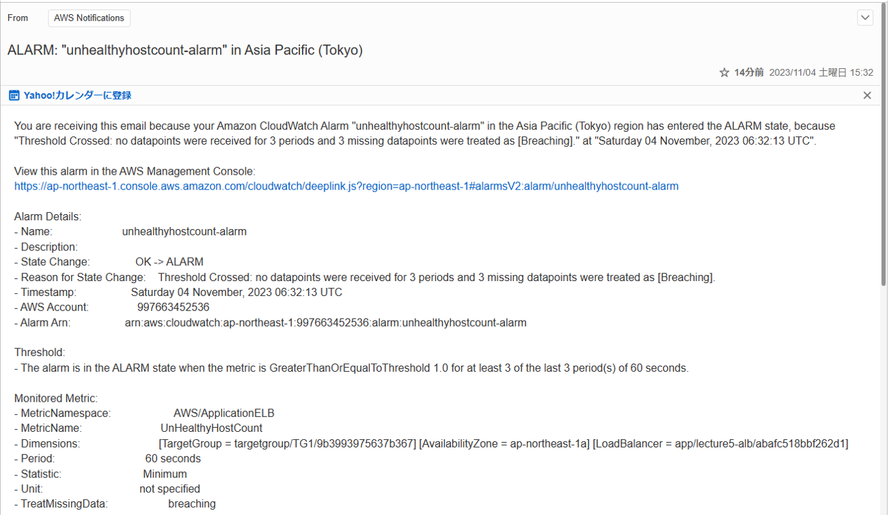
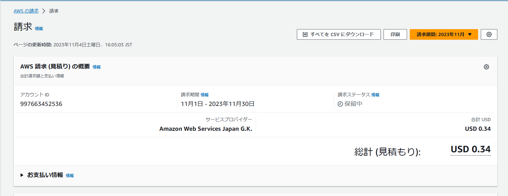
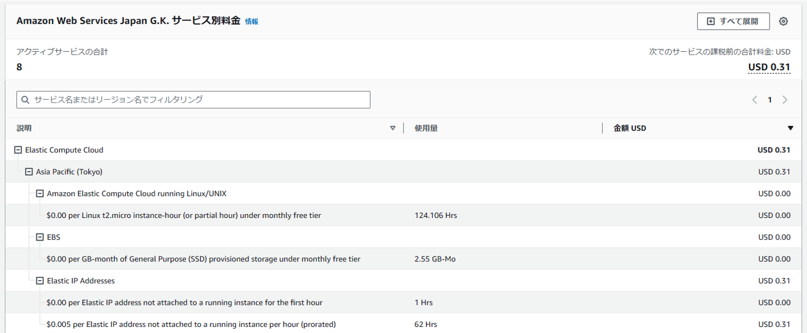

# 第6回課題提出
## CloudTrail のイベント
- StopDBInstance(RDSの停止)
- 含まれている情報は"イベント時間""イベントソース""発信元IPアドレス"等がある

- StopInstance(EC2の停止)

- StartDBInstance(RDSの起動)

## CloudWatch アラーム
- アラーム設定

- インスタンス正常時のメール

- インスタンス異常時のメール

## AWS利用料の見積り
[見積り](https://calculator.aws/#/estimate?id=ea3b32012d8e10270ab12bb7b4220aa86848f725)

## 現在の利用料
- 今月のAWS利用料

- 今月のEC2利用料

- 発生費用はEC2のelasticIPを関連付けせずのままであったためだった。今回までの課題では使用しなかったので削除した

## 感想
- 安定稼働及び証跡を取ることの重要性を学んだ
- 今まで「logを取る必要性」はシステム構築時に何が問題であるか把握するために取るものであったが、今回の講義を聞き不正アクセス等の履歴を残すため必須であるものに認識が変わった
- AWSでは様々なlogを残す方法があることを知った

