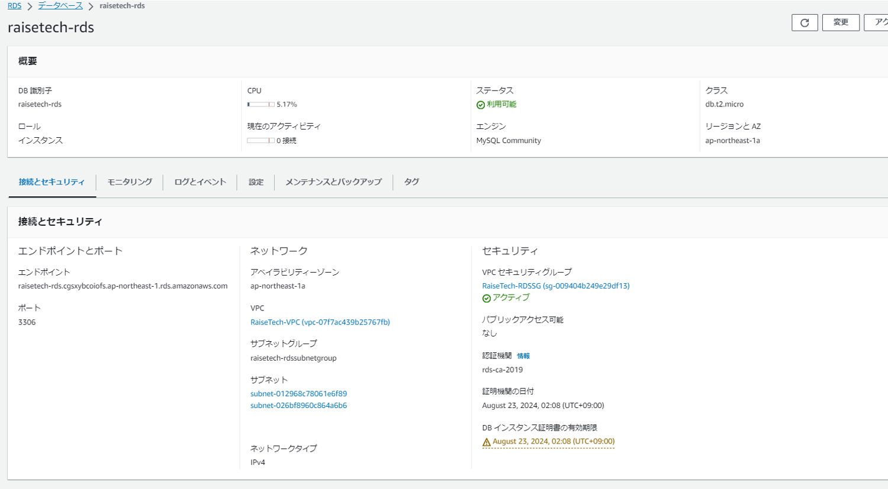

# 第10回課題提出
- CloudFormationを利用し、これまでに手動構築した環境をコード化し自動構築する
- CloudFormationとはYAML形式ファイルを読み込ませることで、ファイルに記述された環境が自動構築される。
- 1つのファイルを読み込ませると、スタックと呼ばれる1つの単位で環境が生成される。
- 読み込ませるファイルのことをテンプレートと呼ぶ。

## 環境構築手順
- スタック分割基準のベストプラクティスには様々な考察があり、調べた中では「リソースの管理者で分ける」「システムのライフサイクルを考慮し分ける」等があったが、今回は各リソーステンプレートの記述内容理解を主とするためリソース毎スタックを分割し環境を構築した。
- リソース毎に分け製作することから、Outputsで値を出力し !ImportValue "export名" で他ファイルへ入力しIDを紐づけた。
- 今回はParametersを用い変数を事前に設定することで、設定を変更し再度環境構築したい際に値を振り直し易い形で作成した。
- 下記今回作成したスタックである

## VPC作成
- [vpc.yml](https://github.com/fumiya80/lecture-master/blob/cd846a75127c7995cd5fc4bb21d3bd71a396ef33/cloudformation/vpc.yml)
- 構築した環境

## SecurityGroup作成
- [SG.yml](https://github.com/fumiya80/lecture-master/blob/cd846a75127c7995cd5fc4bb21d3bd71a396ef33/cloudformation/SG.yml)

### ALB用SecurityGroup

### EC2用SecurityGroup
- 構築した環境

### RDS用SecurityGroup
- 構築した環境

## EC2作成
- [EC2.yml](https://github.com/fumiya80/lecture-master/blob/cd846a75127c7995cd5fc4bb21d3bd71a396ef33/cloudformation/EC2.yml)
- 構築した環境

## IAM作成
- [S3Accesslole.yml](https://github.com/fumiya80/lecture-master/blob/cd846a75127c7995cd5fc4bb21d3bd71a396ef33/cloudformation/S3Accesslole.yml)
- 構築した環境

## RDS作成
- [RDS.yml](https://github.com/fumiya80/lecture-master/blob/cd846a75127c7995cd5fc4bb21d3bd71a396ef33/cloudformation/RDS.yml)
- 構築した環境

## ALB作成
- [ALB.yml](https://github.com/fumiya80/lecture-master/blob/cd846a75127c7995cd5fc4bb21d3bd71a396ef33/cloudformation/ALB.yml)
- 構築した環境

## S3作成
- [S3.yml](https://github.com/fumiya80/lecture-master/blob/cd846a75127c7995cd5fc4bb21d3bd71a396ef33/cloudformation/S3.yml)
- 構築した環境

## 感想
- これまで手動構築した環境をコードにすることで、各サービスの紐づきが可視化され理解が深まった。
- サービスを自動構築するためのテンプレートは検索で出てくるが、取り入れたい機能を入れようと探すことが面白く又難しいと感じた。
- 後々設定を変えて再度構築する際に使い回しを良くするためには、どのようにParametersを設定するべきか頭を悩ませた。
- 今後は様々な機能を調べ盛り込んでいきたい。
- 今回使用しなかった関数もあるので更に勉強し、理解しやすいコードが書けるようになりたい。

