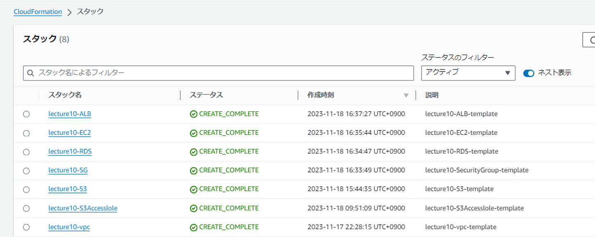
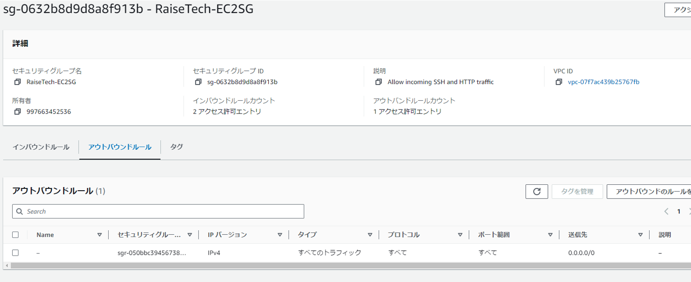

# 第10回課題提出
- CloudFormationを利用し、これまでに手動構築した環境をコード化し自動構築する
- CloudFormationとはYAML形式ファイルを読み込ませることで、ファイルに記述された環境が自動構築される。
- 1つのファイルを読み込ませると、スタックと呼ばれる1つの単位で環境が生成される。
- 読み込ませるファイルのことをテンプレートと呼ぶ。

## 環境構築手順
- 今回は作成するサービス毎(EC2やRDS等)にスタックを分けて環境を構築する。
- サービス毎に分けて製作することから、Outputsで値を出力し !ImportValue "論理 ID" で他ファイルへ入力させることで、様々な紐づけを行った。 ex) SecurityGroupテンプレートからEC2用SecurityGroupを出力し、EC2テンプレートに入力しEC2と紐づける
- ある値を紐づけるには、事前に他テンプレートで出力させておかなければならない。 ex) EC2へ他テンプレートで作成したSecurityGroupを紐づけるには、事前に他テンプレートからEC2用SecurityGroupを出力しなければならない
- 下記今回作成したスタックである

- 今回はParametersを用い変数を事前に設定することで、設定を変更し再度環境構築したい際に値を振り直し易い形で作成した。

## VPC作成
- Parameters  
  #vpc----------------------------------------------------------------------  
  VpcCidrBlock:  
    Description: Input a VPC IPv4 CidrBlock. # ex 192.168.2.0/16  
    Type: String  
    Default: "10.0.0.0/16"  
  VpcName:  
    Description: Input a VPC name. This Parameter will be a Name tag.  
    Type: String  
    Default: "RaiseTech-VPC"  
  
  #igw----------------------------------------------------------------------
  InternetGwName:
    Description: Input a IntenetGW name. This Parameter will be a Name tag.
    Type: String
    Default: "RaiseTech-IGW"
  #publicsubnet-------------------------------------------------------------
  AZ1:
    Description: Input a AZ where Public Subnet will be created.
    Type: AWS::EC2::AvailabilityZone::Name
    Default: "ap-northeast-1a"
  PublicSubnet1CidrBlock:
    Description: Input a Public Subnet IPv4 CidrBlock.  #ex 192.168.2.0/25
    Type: String
    Default: "10.0.0.0/20"
  PublicSubnet1Name:
    Description: Input a Public Subnet name. This Parameter will be a Name tag.
    Type: String
    Default: "RaiseTech-PublicSubnet1"

  AZ2:
    Description: Input a AZ where Public Subnet will be created.
    Type: AWS::EC2::AvailabilityZone::Name
    Default: "ap-northeast-1c"
  PublicSubnet2CidrBlock:
    Description: Input a Public Subnet IPv4 CidrBlock.  #ex) 192.168.2.0/25
    Type: String
    Default: "10.0.64.0/20"
  PublicSubnet2Name:
    Description: Input a Public Subnet name. This Parameter will be a Name tag.
    Type: String
    Default: "RaiseTech-PublicSubnet2"

  #privatesubnet------------------------------------------------------------
  AZ3:
    Description: Input a AZ where Private Subnet will be created.
    Type: AWS::EC2::AvailabilityZone::Name
    Default: "ap-northeast-1a"
  PrivateSubnet1CidrBlock:
    Description: Input a Private Subnet IPv4 CidrBlock.  #ex) 192.168.2.0/25
    Type: String
    Default: "10.0.16.0/20"
  PrivateSubnet1Name:
    Description: Input a Private Subnet name. This Parameter will be a Name tag.
    Type: String
    Default: "RaiseTech-PrivateSubnet1"

  AZ4:
    Description: Input a AZ where Private Subnet will be created.
    Type: AWS::EC2::AvailabilityZone::Name
    Default: "ap-northeast-1c"
  PrivateSubnet2CidrBlock:
    Description: Input a Private Subnet IPv4 CidrBlock.  #ex) 192.168.2.0/25
    Type: String
    Default: "10.0.32.0/20"
  PrivateSubnet2Name:
    Description: Input a Private Subnet name. This Parameter will be a Name tag.
    Type: String
    Default: "RaiseTech-PrivateSubnet2"

  #PublicRouteTable------------------------------------------------------------
  PublicRouteTableName:
    Description: Input a RouteTable name. This Parameter will be a Name tag.
    Type: String
    Default: "RaiseTech-PublicRouteTable"

  #PrivateRouteTable------------------------------------------------------------
  PrivateRouteTable1Name:
    Description: Input a RouteTable name. This Parameter will be a Name tag.
    Type: String
    Default: "RaiseTech-PrivateRouteTable1"

  PrivateRouteTable2Name:
    Description: Input a RouteTable name. This Parameter will be a Name tag.
    Type: String
    Default: "RaiseTech-PrivateRouteTable2"

- Resources
  #vpc----------------------------------------------------------------------
  MyVPC:
    Type: AWS::EC2::VPC
    Properties:
      CidrBlock: !Ref VpcCidrBlock
      EnableDnsHostnames: true
      EnableDnsSupport: true
      InstanceTenancy: default
      Tags:
        - Key: Name
          Value: !Ref VpcName

  #igw----------------------------------------------------------------------
  MyInternetGW:
    Type: AWS::EC2::InternetGateway
    Properties:
      Tags:
        - Key: Name
          Value: !Ref InternetGwName
  MyVPCGatewayAttachment:
    Type: AWS::EC2::VPCGatewayAttachment
    Properties:
      InternetGatewayId: !Ref MyInternetGW
      VpcId: !Ref MyVPC

  #publicsubnet-------------------------------------------------------------   
  MyPublicSubnet1:
    Type: AWS::EC2::Subnet
    Properties:
      AvailabilityZone: !Ref AZ1
      CidrBlock: !Ref PublicSubnet1CidrBlock
      MapPublicIpOnLaunch: true
      Tags:
        - Key: Name
          Value: !Ref PublicSubnet1Name
      VpcId: !Ref MyVPC

  MyPublicSubnet2:
    Type: AWS::EC2::Subnet
    Properties:
      AvailabilityZone: !Ref AZ2
      CidrBlock: !Ref PublicSubnet2CidrBlock
      MapPublicIpOnLaunch: true
      Tags:
        - Key: Name
          Value: !Ref PublicSubnet2Name
      VpcId: !Ref MyVPC

  #privatesubnet------------------------------------------------------------
  MyPrivateSubnet1:
    Type: AWS::EC2::Subnet
    Properties:
      AvailabilityZone: !Ref AZ3
      CidrBlock: !Ref PrivateSubnet1CidrBlock
      MapPublicIpOnLaunch: false
      Tags:
        - Key: Name
          Value: !Ref PrivateSubnet1Name
      VpcId: !Ref MyVPC

  MyPrivateSubnet2:
    Type: AWS::EC2::Subnet
    Properties:
      AvailabilityZone: !Ref AZ4
      CidrBlock: !Ref PrivateSubnet2CidrBlock
      MapPublicIpOnLaunch: false
      Tags:
        - Key: Name
          Value: !Ref PrivateSubnet2Name
      VpcId: !Ref MyVPC

  #Publicroutetable------------------------------------------------------------
  MyPublicRouteTable:
    Type: AWS::EC2::RouteTable
    Properties:
      Tags:
        - Key: Name
          Value: !Ref PublicRouteTableName
      VpcId: !Ref MyVPC

  MyPublicRoute:
    Type: AWS::EC2::Route
    Properties:
      DestinationCidrBlock: 0.0.0.0/0
      GatewayId: !Ref MyInternetGW
      RouteTableId: !Ref MyPublicRouteTable

  MyPublicSubnet1RouteTableAssociation:
    Type: AWS::EC2::SubnetRouteTableAssociation
    Properties:
      RouteTableId: !Ref MyPublicRouteTable
      SubnetId: !Ref MyPublicSubnet1

  MyPublicSubnet2RouteTableAssociation:
    Type: AWS::EC2::SubnetRouteTableAssociation
    Properties:
      RouteTableId: !Ref MyPublicRouteTable
      SubnetId: !Ref MyPublicSubnet2

  #Privateroutetable----------------------------------------------------------
  MyPrivateRouteTable1:
    Type: AWS::EC2::RouteTable
    Properties:
      Tags:
        - Key: Name
          Value: !Ref PrivateRouteTable1Name
      VpcId: !Ref MyVPC

  MyPrivateRouteTable2:
    Type: AWS::EC2::RouteTable
    Properties:
      Tags:
        - Key: Name
          Value: !Ref PrivateRouteTable2Name
      VpcId: !Ref MyVPC

  MyPrivateSubnet1RouteTable1Association:
    Type: AWS::EC2::SubnetRouteTableAssociation
    Properties:
      RouteTableId: !Ref MyPrivateRouteTable1
      SubnetId: !Ref MyPrivateSubnet1

  MyPrivateSubnet2RouteTable2Association:
    Type: AWS::EC2::SubnetRouteTableAssociation
    Properties:
      RouteTableId: !Ref MyPrivateRouteTable2
      SubnetId: !Ref MyPrivateSubnet2

- 構築した環境

## SecurityGroup作成
### ALB用SecurityGroup
- Parameters
  ALBSGName:
    Type: String
    Default: "RaiseTech-ALBSG"

- Resources
  MyALBSG:
    Type: AWS::EC2::SecurityGroup
    Properties:
      GroupName: !Ref ALBSGName
      VpcId: !ImportValue RaiseTech-VPC
      GroupDescription: "Allow incoming traffic on port 80"
      SecurityGroupIngress:
        - IpProtocol: tcp
          FromPort: 80
          ToPort: 80
          CidrIp: 0.0.0.0/0
      Tags:
        - Key: Name
          Value: !Ref ALBSGName

- 構築した環境

### EC2用SecurityGroup
- Parameters
  MyIP:
    Description: IP address allowed to access EC2
    Type: String
    Default: "60.147.36.53/32"

  EC2SGName:
    Type: String
    Default: "RaiseTech-EC2SG"

- Resources
  MyEC2SG:
    Type: AWS::EC2::SecurityGroup
    Properties:
      GroupName: !Ref EC2SGName
      VpcId: !ImportValue RaiseTech-VPC
      GroupDescription: "Allow incoming SSH and HTTP traffic"
      SecurityGroupIngress:
        - IpProtocol: tcp
          FromPort: 22
          ToPort: 22
          CidrIp: !Ref MyIP
        - IpProtocol: tcp
          FromPort: 80
          ToPort: 80
          SourceSecurityGroupId: !Ref MyALBSG  #このセキュリティグループとの通信は許可する

- 構築した環境

### RDS用SecurityGroup
- Parameters
  RDSSGName:
    Type: String
    Default: "RaiseTech-RDSSG"

- Resources
  MyRDSSG:
    Type: AWS::EC2::SecurityGroup
    Properties:
      GroupName: !Ref RDSSGName
      VpcId: !ImportValue RaiseTech-VPC
      GroupDescription: "Allow incoming traffic on port 3306"
      SecurityGroupIngress:
        - IpProtocol: tcp
          FromPort: 3306
          ToPort: 3306
          SourceSecurityGroupId: !Ref MyEC2SG

- 構築した環境

## IAM作成
- Parameters

## EC2作成
- Parameters
  EC2Name:
   Type: String
   Default: "RaiseTech-EC2"

  EC2ImageId:
    Type: AWS::SSM::Parameter::Value<String>
    Default: /aws/service/ami-amazon-linux-latest/amzn2-ami-hvm-x86_64-gp2

  EC2InstanceType:
    Type: String
    Default: "t2.micro"

  EC2AZ:
    Type: AWS::EC2::AvailabilityZone::Name
    Default: "ap-northeast-1a"

- Resources
  #EC2KeyPair---------------------------------------------------------------
  MyKeyPair:
    Type: AWS::EC2::KeyPair
    Properties:
      KeyName: KeyPair-MyEC2

  #EC2----------------------------------------------------------------------
  MyEC2:
    Type: AWS::EC2::Instance
    Properties:
      AvailabilityZone: !Ref EC2AZ
      ImageId: !Ref EC2ImageId #AMIを選択
      InstanceType: !Ref EC2InstanceType
      KeyName: !Ref MyKeyPair
      Monitoring: false
      NetworkInterfaces:
        - GroupSet:
            - !ImportValue RaiseTech-EC2SG
          SubnetId: !ImportValue RaiseTech-PublicSubnet1
          AssociatePublicIpAddress: true #インスタンスにIPアドレスを割り当てる
          DeviceIndex: "0"
      IamInstanceProfile: !ImportValue RaiseTech-EC2InstanceProfile #IAMroleを付与
      Tags:
        - Key: Name
          Value: !Ref EC2Name

- 構築した環境

## IAM作成(スタックではEC2より前に作成)
- Parameters
  MyEC2InstanceProfileName:
    Type: String
    Default: "RaiseTech-EC2InstanceProfile"

- Resources
  #IAMRole------------------------------------------------------------------
  MyS3AccessRole:
    Type: AWS::IAM::Role
    Properties:
      AssumeRolePolicyDocument:
        Version: 2012-10-17
        Statement: 
          - Effect: Allow
            Principal:
              Service:  #許可の対象  
                - ec2.amazonaws.com
            Action:
              - sts:AssumeRole
      Path: /
      ManagedPolicyArns:  #IAMポリシーを選択                  
        - arn:aws:iam::aws:policy/AmazonS3FullAccess

  #InstanceProfile------------------------------------------------------------------
  MyEC2InstanceProfile:  #EC2とIAMroleを紐づけに必要。                 
    Type: AWS::IAM::InstanceProfile
    Properties:
      Path: /
      Roles:
        - !Ref MyS3AccessRole

- 構築した環境

## RDS作成
- Parameters
  RDSName:
   Type: String
   Default: "RaiseTech-RDS"

  RDSAZ:
    Type: AWS::EC2::AvailabilityZone::Name
    Default: "ap-northeast-1a"

  RDSMasterUserPassword:
    Type: String
    Default: "adminadmin"

  RDSSubnetGroupName:
   Type: String
   Default: "RaiseTech-RDSSubnetGroup"

- Resources
  #RDSubnetgroup------------------------------------------------------------
  MyRDSSubnetGroup:
    Type: AWS::RDS::DBSubnetGroup
    Properties:
      DBSubnetGroupDescription: "RDSSubnetGroup"
      DBSubnetGroupName: !Ref RDSSubnetGroupName
      SubnetIds:
        - !ImportValue RaiseTech-PrivateSubnet1
        - !ImportValue RaiseTech-PrivateSubnet2
      Tags:
        - Key: Name
          Value: !Ref RDSSubnetGroupName

  #RDS----------------------------------------------------------------------
  MyRDS:
   Type: AWS::RDS::DBInstance
   DeletionPolicy: Delete
   UpdateReplacePolicy: Delete
   Properties:
     AvailabilityZone: !Ref RDSAZ
     DBInstanceIdentifier: !Ref RDSName
     VPCSecurityGroups:
       - !ImportValue RaiseTech-RDSSG
     DBSubnetGroupName: !Ref MyRDSSubnetGroup
     DBInstanceClass: db.t2.micro
     AllocatedStorage: 20
     Engine: mysql
     StorageType: gp2
     MasterUsername: admin
     MasterUserPassword: !Ref RDSMasterUserPassword
     CopyTagsToSnapshot: false                             #スナップショットにタグを関連付ける
     DeleteAutomatedBackups: true                          #RDS削除時に生成されるスナップショットの削除
     PubliclyAccessible: false
     MultiAZ: false
     Tags:
       - Key: Name
         Value: !Ref RDSName

- 構築した環境

## ALB作成
- Parameters
  #ALB----------------------------------------------------------------------
  ALBName:
    Type: String
    Default: "RaiseTech-ALB"

  #TargetGroup--------------------------------------------------------------
  TargetGroupName:
    Type: String
    Default: "RaiseTech-TargetGroup"

- Resources 
  #ALB---------------------------------------------------------------------
  MyALB:
    Type: AWS::ElasticLoadBalancingV2::LoadBalancer
    Properties:
      Type: application
      IpAddressType: ipv4
      Name: !Ref ALBName
      Scheme: internet-facing
      SecurityGroups:
        - !ImportValue RaiseTech-ALBSG
      SubnetMappings:
        - SubnetId: !ImportValue RaiseTech-PublicSubnet1
        - SubnetId: !ImportValue RaiseTech-PublicSubnet2
      Tags:
        - Key: Name
          Value: !Ref ALBName

  #TargetGroup--------------------------------------------------------------
  MyTargetGroup:
    Type: AWS::ElasticLoadBalancingV2::TargetGroup
    Properties:
      VpcId: !ImportValue RaiseTech-VPC
      IpAddressType: ipv4
      Protocol: HTTP  #ヘルスチェックを行う際のプロトコル
      ProtocolVersion: HTTP1
      Port: 80
      TargetType: instance
      Targets:
        - Id: !ImportValue RaiseTech-EC2
          Port: 80
      HealthCheckEnabled: true                        #ヘルスチェック有効化
      HealthCheckIntervalSeconds: 60                  #ヘルスチェックの間隔
      HealthCheckPath: /
      HealthCheckPort: traffic-port  #ヘルスチェックを行う際に使用するポート
      HealthCheckProtocol: HTTP
      HealthCheckTimeoutSeconds: 5
      HealthyThresholdCount: 3
      UnhealthyThresholdCount: 3
      Matcher:
        HttpCode: 200
      Tags:
        - Key: Name
          Value: !Ref TargetGroupName

  #Listener-----------------------------------------------------------------
  ALBListener:
    Type: AWS::ElasticLoadBalancingV2::Listener    
    Properties:
      Port: 80
      Protocol: HTTP
      DefaultActions:
         - TargetGroupArn: !Ref MyTargetGroup
           Type: forward
      LoadBalancerArn: !Ref MyALB

- 構築した環境

## S3作成 
- Parameters 
  S3Name: 
   Type: String
   Default: "raisetech-s3-231118"

- Resources 
  MyS3:
    Type: AWS::S3::Bucket
    Properties:
      BucketName: !Ref S3Name
      AccessControl: Private
      PublicAccessBlockConfiguration:
        BlockPublicAcls: True
        BlockPublicPolicy: True
        IgnorePublicAcls: True
        RestrictPublicBuckets: True
      Tags:
        - Key: Name
          Value: !Ref S3Name

- 構築した環境

## 感想
- これまで手動構築した環境をコードにすることで、各サービスの紐づきが可視化され理解が深まった。
- サービスを自動構築するためのテンプレートは検索で出てくるが、取り入れたい機能を入れようと探すことが面白く又難しいと感じた。
- 後々設定を変えて再度構築する際に便利にするには、どのようにParametersを設定するべきか頭を悩ませた。
- 今後は様々な機能を調べ盛り込んでいきたい。
- 今回使用しなかった関数もあるので更に勉強し、理解しやすいコードが書けるようになりたい。

