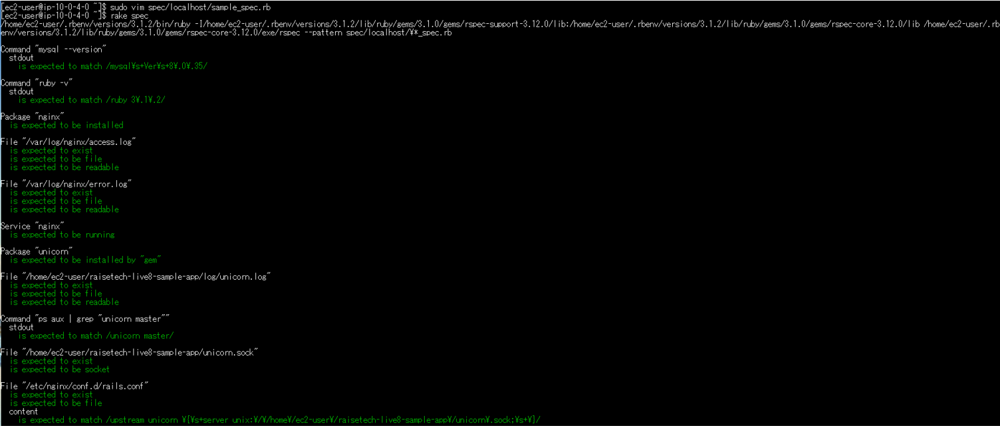
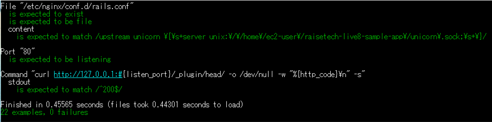

# 第11回課題提出
## ServerSpecを用いたテストコード実施
- 提供されたサンプルを元に内容を変更しテストを実施する。
- 第5回で作成した環境に対してテストを行う。

### Serverspecインストール
```
$ gem install serverspec
```
```
$ serverspec-init
```
### テスト準備
- 生成されたspec/localhost/sample_spec.rb ファイルにテストコードを書き込む。
- 過去の講座で「インフラエンジニアとしてlogを取っていないことは話にならない」とあったので、logファイルに関するテストを追加した。
- 第5回で構築した環境ではunicornとnginxがsocketファイルを用い通信するように設定しており、その設定を確認する内容を追加した。
- テストコードは下記
```
require 'spec_helper'

listen_port = 80


# Mysqlバージョン確認
describe command('mysql --version') do
  its(:stdout) { should match /mysql\s+Ver\s+8\.0\.35/ }
end


# rubyのバージョン確認
describe command('ruby -v') do
  its(:stdout) { should match /ruby 3\.1\.2/ }
end


# Nginxインストール確認
describe package('nginx') do
  it { should be_installed }
end


# Nginx.log読取権限確認
%w{
  /var/log/nginx/access.log
  /var/log/nginx/error.log
}.each do |logfile|
describe file(logfile) do
  it { should exist }
  it { should be_file }
  it { should be_readable.by('owner') }
 end
end


# Nginx起動確認
describe service('nginx') do
  it { should be_running }
end


# unicornインストール確認
describe package('unicorn') do
  it { should be_installed.by('gem') }
end


# unicorn.log読取権限確認
describe file('/home/ec2-user/raisetech-live8-sample-app/log/unicorn.log') do
  it { should exist }
  it { should be_file }
  it { should be_readable.by('owner') }
end


# unicorn起動確認(masterプロセス)
describe command('ps aux | grep "unicorn master"') do
  its(:stdout) { should match /unicorn master/ }
end


# unicornのソケットファイル生成場所確認
describe file('/home/ec2-user/raisetech-live8-sample-app/unicorn.sock') do
  it { should exist }
  it { should be_socket }
end


# nginxファイルにunicornのソケットファイルを参照する記述の有無確認
describe file('/etc/nginx/conf.d/rails.conf') do
  it { should exist }
  it { should be_file }
  its(:content) { should match /upstream unicorn \{\s+server unix:\/\/home\/ec2-user\/raisetech-live8-sample-app\/unicorn\.sock;\s+\}/ }
end


# 指定のportでlistenしているか
describe port(listen_port) do
  it { should be_listening }
end


# 指定されたURLに対してHTTPリクエストを送信し、レスポンスのHTTPステータスコードが200（成功）であることを確認するテス>ト。
describe command('curl http://127.0.0.1:#{listen_port}/_plugin/head/ -o /dev/null -w "%{http_code}\n" -s') do
  its(:stdout) { should match /^200$/ }
end

```

- `rake spec` でテスト実行

### 実行結果



