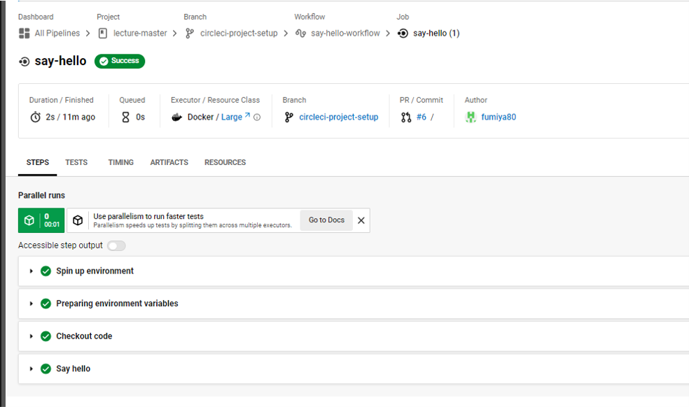
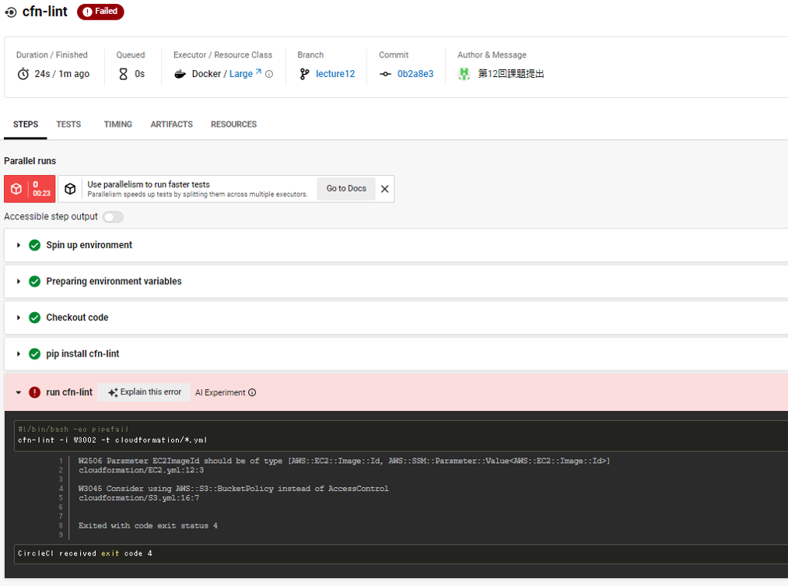
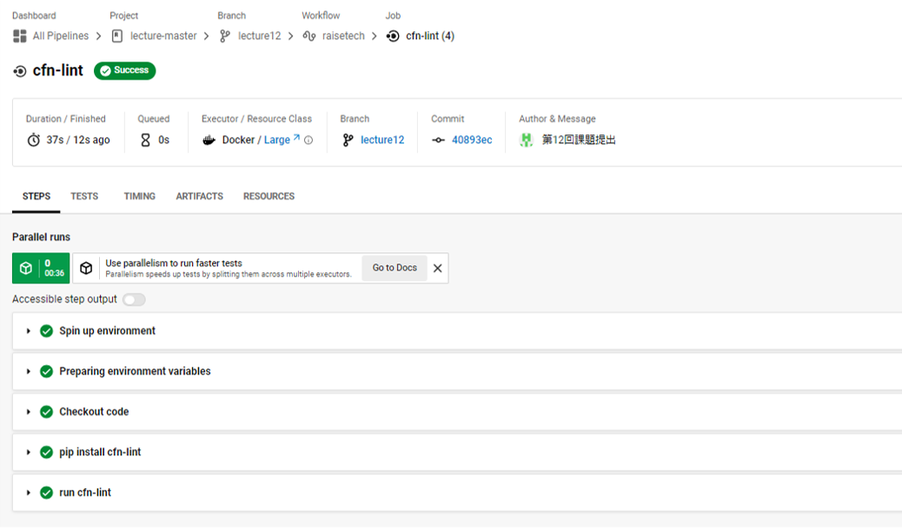

# 第12回課題提出
## CircleCIを使いcloudformationテンプレートのコードチェックをする
- 第10回で作成したcloudformationテンプレートに対しコードチェックを行う。
- 提供されたコンフィグファイルをローカルリポジトリにて組み込む。
- リモートリポジトリにプッシュするとcfn-lintが自動的に実行され、Cloudformationテンプレートのコードチェックが行われる。
[config.yml](./.circleci/config.yml)

### CircleCI動作確認

### cloudformationテンプレートに対してコードチェック

- エラー内容を修正し再度コードチェック

