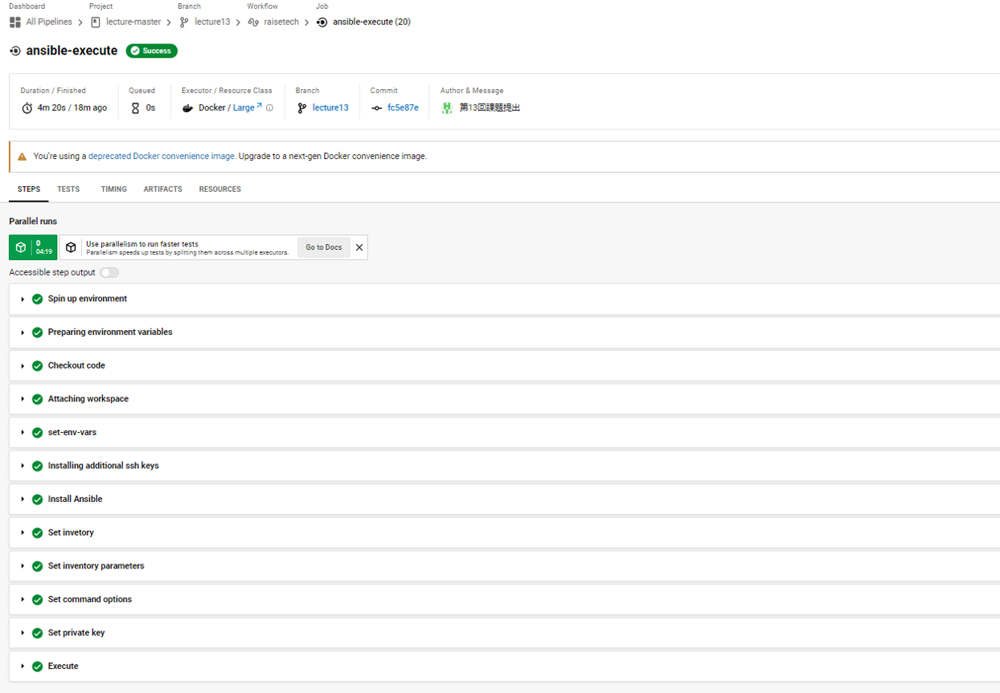

# 第13回課題提出
## CircleCIにてCloudFormation、Ansible、Serverspec処理を追加
- CloudFormationテンプレート(第10回で作成済)を用いインフラ構築を行う。
- サーバーの環境構築とアプリのデプロイ(第5回で実施済)をコード化しAnsibleの処理を行う。
- Serverspecのテスト(第11回で作成済)を行う。

## cfnテンプレートでのインフラ構築
- AWS CLIを用い下記のインフラ構築を行う  

- circleciのconfigファイルにAWS CLIでcfnテンプレートを実行する処理を追加 詳細は[cloudformation](./cloudformation)ディレクトリ参照
```
# 一部抜粋
  cfn-execute:
    executor: aws-cli/default
    steps:
      - checkout
      - aws-cli/setup:
          aws_access_key_id: AWS_ACCESS_KEY_ID
          aws_secret_access_key: AWS_SECRET_ACCESS_KEY
          region: AWS_DEFAULT_REGION
      - run:
          name: deploy Cloudformation
          command: |
            aws cloudformation deploy --stack-name lecture13-vpc --template-file cloudformation/vpc.yml
            aws cloudformation deploy --stack-name lecture13-SG --template-file cloudformation/SG.yml --parameter-overrides MyIP="${AWS_MY_IP}"
            aws cloudformation deploy --stack-name lecture13-S3Accesslole --template-file cloudformation/S3Accesslole.yml --capabilities CAPABILITY_IAM
            aws cloudformation deploy --stack-name lecture13-EC2 --template-file cloudformation/EC2.yml
            aws cloudformation deploy --stack-name lecture13-RDS --template-file cloudformation/RDS.yml
            aws cloudformation deploy --stack-name lecture13-ALB --template-file cloudformation/ALB.yml
            aws cloudformation deploy --stack-name lecture13-S3 --template-file cloudformation/S3.yml
```
- circleciでの実行結果  


## ansibleでの環境構築とアプリのデプロイ
- circleciのconfigファイルにAnsibleのPlaybookを実行する処理を追加 詳細は[ansible](./ansible)ディレクトリ参照
```
# 一部抜粋
  ansible-execute:
    executor: ansible/default
    steps:
      - checkout
      - attach_workspace:
          at: /tmp
      - run:
          name: set-env-vars
          command: |
            echo "export AWS_EC2_HOST=$(cat /tmp/AWS_EC2_HOST.txt)" >> $BASH_ENV
            echo "export AWS_ALB_HOST=$(cat /tmp/AWS_ALB_HOST.txt)" >> $BASH_ENV
            echo "export AWS_DB_HOST=$(cat /tmp/AWS_DB_HOST.txt)" >> $BASH_ENV
            echo "export AWS_DB_USER=$(cat /tmp/AWS_DB_USER.txt)" >> $BASH_ENV
            echo "export AWS_DB_PW=$(cat /tmp/AWS_DB_PW.txt)" >> $BASH_ENV
      - add_ssh_keys:
          fingerprints:
            - '90:f2:ce:d1:d1:f0:59:9c:58:db:e1:14:cb:35:5f:6a'
      - ansible/install:
          version: 2.10.7
      - ansible/playbook:
          playbook: ansible/playbook.yml
          playbook-options: '-u ec2-user -i ansible/inventory --private-key /home/ec2-user/.ssh/id_rsa'
```
- circleciでの実行結果  
  
- ALBのDNS名でアクセスし、アプリが動作することを確認  
  
- S3に保存されていることを確認  


## Serverspecによるテスト
- circleciのconfigファイルにServerspecのテストを実行する処理を追加 詳細は[serverspec](./serverspec]ディレクトリ参照
```
# 一部抜粋
  serverspec-execute:
    executor: ruby/default
    steps:
      - checkout
      - ruby/install:
          version: '3.1.2'
      - ruby/install-deps:
          app-dir: serverspec
      - run:
          name: execute serverspec
          command: |
            cd serverspec
            bundle exec rake spec
```
- circleciでの実行結果  

