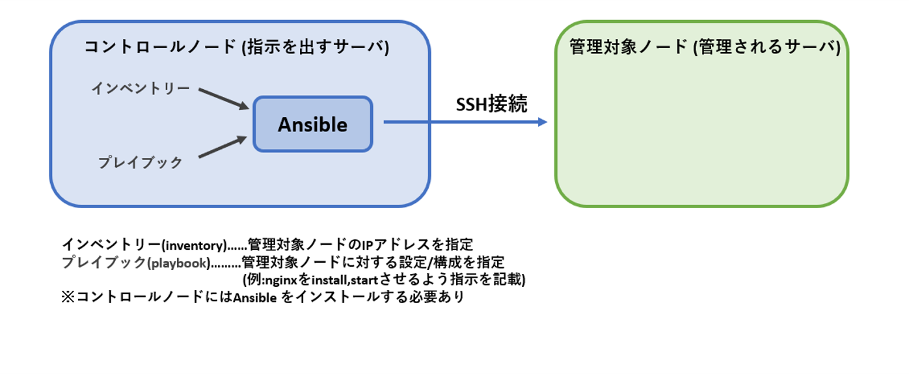
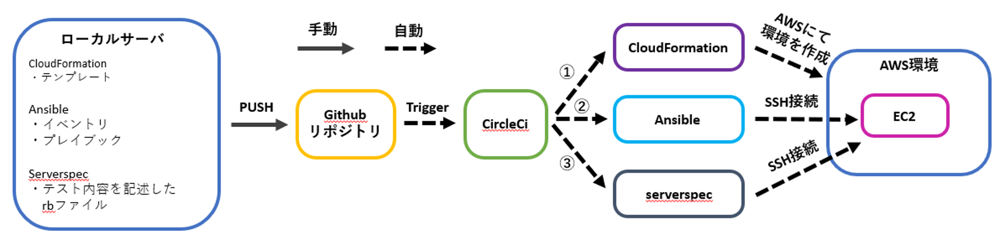
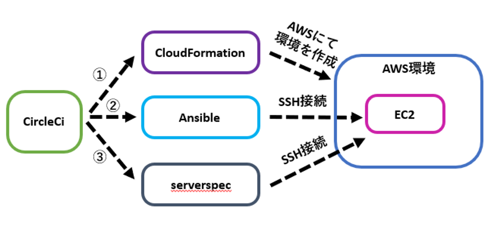
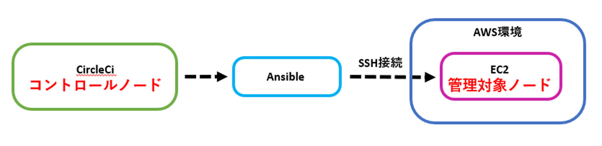

# 構成図再現手順

# 1.使用するサービスの説明 (具体的手順は3.CircleCiとcfnから)

## 1-1.CircleCi
### 1-1-1.概要
- CircleCiはCI/CDツールの1種である。  
- CI(継続的インティグレーション)とはアプリやインフラのソースコードのテストを自動化し、これを継続的に実行すること。
- CD(継続的デリバリー)とは各環境へのデプロイ作業を自動化し、これを継続的に実行すること。
- CircleCiはソースコードのバージョン管理ができるgithubと連携できる
- これらからソースコードのバージョン管理/テスト/各サーバーへのデプロイを自動で行えることで、開発に集中できる


### 1-1-2.使用方法
- CircleCiで行うことは.circleci/config.ymlに記載し、このファイル内容をCircleCiが実行する。
- 下記はcircleci/config.ymlの抜粋
- "version"とはCircleCIのバージョンのことである
- "orbs"とはCircleCIの機能や設定を利用するためのパッケージであり(orbs一覧は公式にて)、これによりconfigファイル内で特定の設定(jobを実行する環境)として利用できる。(上記config.ymlでは"circleci/python@2.0.3"という"orbs"を"python"と命名している。)
- "job"とはCircleCiで実行される単一のタスクで"step"の集合体であり、上記では"cfn-lint"と命名した"job"で"checkout","run"×2が"step"にあたる
- "executor"とは"job"の実行環境を指定するものであり、上記では"orbs"で"python"と命名した設定を呼び出している
```
version: 2.1

orbs:
  python: circleci/python@2.0.3

jobs:
  cfn-lint:
    executor: python/default
    steps:
      - checkout
      - run: pip install cfn-lint
      - run:
          name: run cfn-lint
          command: |
            cfn-lint -i W3002 -t cloudformation/*.yml
```

### 1-1-3.今回の用途
- AWS環境を自動構築(CloudFormation)、アプリデプロイのためEC2を自動環境設定(ansible)、EC2の環境設定を自動テスト(serverspec)、これらのソースコードをgithubへプッシュのみし一連で行うことを可能にする
- これで開発作業に集中できる環境を作る

<br>
<br>
<br>
<br>

## 1-2.CloudFormation(以降cfn)
### 1-2-1.概要
- cfnはインフラを自動化するために必要なIaC(Infrastructure as code)を行えるAWSのサービス。
- IaC(Infrastructure as code)とはインフラをコード化すること。
- インフラ自動化のメリットは、手動構築と比較し工数が少ない/再現性が高い/バージョン管理が容易なことが挙げられる
- リソース構築内容を定義するファイルをテンプレートと呼び、複数のリソースの依存関係もテンプレートに記述される。
- テンプレートを利用しcfnによりプロビジョニングされたリソースの集合体をスタックと呼ぶ。

### 1-2-2.今回の用途
- VPC,EC2,RDS,ALB,S3を自動で作成し、AWS環境を構築する。


<br>


<br>


## 1-3.ansible
### 1-3-1.概要
- ansibleは構成管理ツールの1種である。
- 構成管理ツールとは管理対象サーバーの設定/構成ファイルをコードで定義し、定義内容と異なる場合は予め定義した設定/構成に変更するものである。(例えばrailsはversion 7.0.4と定義すると、異なるversionの場合は7.0.4に自動で変更する)
- これにより手動のコマンド操作でサーバを設定/構成することが不要、自動で何度行っても同じ設定/構成となる。この何度行っても設定/構成が同じになることを冪等性(べきとうせい)と呼ぶ。

### 1-3-2.ノードと必要ファイル
- コントロールノード(Control node)…………設定/構成ファイルを基に指示を出すサーバー
- 管理対象ノード(Managed node)…………コントロールノードから指示を受け、設定/構成ファイルを基に管理されるサーバー
- イベントリ(iventory)…………管理対象ノードを指定するファイル、IPアドレスを記載する。
- プレイブック(playbook)…………管理対象ノードに対する設定/構成を記述するファイル


### 1-3-3.playbookの中身
- モジュール(module)…………playbookを構成する最小単位のこと。例として管理ノード上で指定したシェルコマンドを実行するshellmodule、管理ノード上のサービスを制御するsystemdmodule等がある
- タスク(task)…………moduleのパラメーターに値を設定し実行可能となったもの。taskには固有のtask名を設定する
- プレイ(play)…………1つ以上のタスクを並べ、管理対象ノードと変数等を加えたものをプレイと呼ぶ。
[プレイブックの基本](https://zenn.dev/y_mrok/books/ansible-no-tsukaikata/viewer/chapter8)
- Playbookの記述例を下記に示す
```
- name: Setup nginx server   　#play名
  hosts:  　#どのサーバーに対して実行するか。serversをイベントリファイルで定義
    - servers
  tasks:
    - name: check nginx install　 　#task名(タスク1)
  　　shell: bash -lc "nginx -v"  　#shellmoduleを使用しnignxがインストールされているか確認
  　　register: check_nginx_installed　　#タスク1の結果を"check_nginx_installed"と登録

　　- name: nginx install  #task名(タスク2)
  　　shell: bash -lc "amazon-linux-extras install -y nginx1"　　#shellmoduleを使用しnignxをインストール
  　　when: check_nginx_installed is failed　　#タスク1の結果である"check_nginx_installed"が"no"、つまりインストールされていない場合のみタスク2を行う

　　- name: start nginx #task名(タスク3)
  　　systemd:　　#systemdmoduleを使用しnignxを起動させている
    　　name: nginx
    　　state: started
```

### 1-3-5.今回の用途
- cfnで作成したEC2にアプリをデプロイできるよう設定/構成ファイルをコードで定義し、管理対象ノードを変更する。

<br>


<br>

## 1-4.serverspec
### 1-4-1.serverspec概要
- テスト自動化ツールの1種である。
- テストコードはリソースタイプとマッチャーので記述される。
```
describe リソースタイプ(テスト対象) do
  it { マッチャー }
end
```
- リソースタイプはテストする対象のリソースを指定、マッチャーはリソースへ期待する状態を指定する。以下一例
- 全てのリソースタイプは公式にて
[リソースタイプ](https://serverspec.org/resource_types.html)


| リソースタイプ | 説明                                         |
|:--|:--|
| `command`      | コマンドの実行結果をテスト                   |
| `file`         | ファイルの存在,内容,権限等をテスト           |
| `package`      | 指定のパッケージのインストール有無をテスト |
| `port`         | 特定のポートがリスニング状態であるかをテスト         |
| `service`      | 指定のサービスが実行中であるかをテスト        |

| マッチャー      | 説明                                        |
|:--|:--|
| `contain`       | ファイルが指定の文字列を含む      |
| `be_installed`  | パッケージがインストールされていることを確認      |
| `be_running`    | サービスやプロセスが実行中であることを確認        |
| `be_enabled`    | サービスが有効化されていることを確認             |
| `be_listening`  | ポートがリスニング状態であることを確認            |
| `be_owned_by`   | ファイルが特定のユーザーに所有されていることを確認  |

### 1-4-2.今回の用途
- cfnで作成したEC2にアプリをデプロイできるよう設定/構成ファイルをコードで定義し、管理対象ノードを変更する。

<br>


<br>

# 2.手順に入る前に
## 2-1.circleciで意識すること
- 構成図の自動化は下記図の流れで実行される


- 注目してほしいのは下図であり、circleciがcfn,Ansible,serverspecに指示を出し、それぞれを動かしている。
- つまりcircleciが仮想のサーバーとして指示を出すため、通常AWS使用の際に必要なパスワード,SSH接続時に必要なIPアドレスと秘密鍵をcircleciに持たせることが必要(詳しくは手順の中で説明)
- ローカルからプッシュしたファイルの情報以外はcircleciが持っていないことを意識すること。


- またcircleciが仮想のサーバーとなりansibleを起動させEC2へ指示を出すことから、下記の関係性にも意識すること



## 2-2.cfn-ansible-serverspec間で意識すること
- 図①～③の順で実行され、主にansible(EC2の環境設定)はcfnで構築されたRDSやALBの情報を基に設定ファイルを書き換えていく必要がある。
- つまりCloudFormationで構築されたリソースで必要な情報であるRDSのエンドポイントやALBのDNS名はansibleに受け渡す(詳細は手順の中で説明)


<br>


<br>

# 3.CircleCiとcfn
### cfnで実行するjobは下記2つ。cfnテンプレートのコードチェックとデプロイである(configファイルより一部抜粋)
```
  cfn-lint:
    executor: python/default
    steps:
      - checkout
      - run: pip install cfn-lint
      - run:
          name: run cfn-lint
          command: |
            cfn-lint -i W3002 -t cloudformation/*.yml

  cfn-execute:
    executor: aws-cli/default
    steps:
      - checkout
      - aws-cli/setup:
          aws_access_key_id: AWS_ACCESS_KEY_ID
          aws_secret_access_key: AWS_SECRET_ACCESS_KEY
          region: AWS_DEFAULT_REGION
      - run:
          name: deploy Cloudformation
          command: |
            aws cloudformation deploy --stack-name lecture13-vpc --template-file cloudformation/vpc.yml
       　　　～～～～～～～～～～.
            aws cloudformation describe-stacks --stack-name lecture13-ALB --query 'Stacks[].Outputs[0].OutputValue' --output text > /tmp/AWS_ALB_HOST.txt
　　　　　　～～～～～～～～～～
            aws ssm get-parameters --query Parameters[].Value --output text --name RaiseTech-RDS-password1 --with-decryption > /tmp/AWS_DB_PW.txt
      - persist_to_workspace:
          root: /tmp
          paths: AWS*
```
### configファイルの説明
- 今回はaws cliというawsをコマンドラインで操作するためのツールをcircleci上で使用する。
- aws cliを使用するにはアクセスキーとシークレットアクセスキーが必要であり、事前に環境変数としてCircleCiに設定している(上記configではリージョンも事前に設定)
[アクセスキーの作成方法](https://acorn-blog.tech/aws-access-key/)  
[CircleCiに環境変数を設定する方法](https://qiita.com/ashketcham/items/ea211040c841cbf81200)  
- 下記部分の"："以降の文字列が環境変数である
```
aws_access_key_id: AWS_ACCESS_KEY_ID
aws_secret_access_key: AWS_SECRET_ACCESS_KEY
region: AWS_DEFAULT_REGION
```

- 下記はスタック作成のコードであり、"--stack-name"以降にスタック名、"--template-file"以降にファイルの格納の場所を指定する
```
aws cloudformation deploy --stack-name lecture13-vpc --template-file cloudformation/vpc.yml
```
- 下記はスタックのエクスポート値をcircleci上でテキストファイルとしてworkspaceに保存し、他jobで使用できるようにしている。
- "--stack-name"の後にスタックを指定、"Outputs[英数字]"でスタック内で何番目のエクスポート値を指定するか選ぶ。但し1つ目のエクスポート値を0とし数える。"--output text"の後にテキスト名と場所を指定
- またawsパラメータストアで事前に設定してあるRDSのパスワードも取込む
```
aws cloudformation describe-stacks --stack-name lecture13-ALB --query 'Stacks[].Outputs[0].OutputValue' --output text > /tmp/AWS_ALB_HOST.txt
～～～～～～～～～～
aws ssm get-parameters --query Parameters[].Value --output text --name RaiseTech-RDS-password1 --with-decryption > /tmp/AWS_DB_PW.txt
～～～～～～～～～～
- persist_to_workspace:
    root: /tmp
    paths: AWS*
```


<br>


# 4.CircleCiとansible
### ansibleで実行するjobは下記。cfnでのエクスポート値の取込み、circleciサーバへansibleインストール、playbookの実行である(configファイルより抜粋)
```
-   ansible-execute:
    executor: ansible/default
    steps:
      - checkout
      - attach_workspace:
          at: /tmp
      - run:
          name: set-env-vars
          command: |
            echo "export AWS_EC2_HOST=$(cat /tmp/AWS_EC2_HOST.txt)" >> $BASH_ENV
            ～～～～～～～～～～
      - ansible/install:
          version: 2.10.7
      - ansible/playbook:
          playbook: ansible/playbook.yml
          playbook-options: '-i ansible/inventory'
```
### playbookファイルの説明
- playbookの内容が多いので、下記の様にrolesとして分け実行させる。また先程取込んだcfnのエクスポート値をrolesで使用するため定義する。(playbbokより一部抜粋)
- その他で使用したい変数もplaybookで指定する。
```
- hosts: server
  roles:
    - { role: 01_yum, tags: yum }
    - { role: 02_ruby, tags: ruby }
    ～～～～～～～～～～
  vars:
    ansible_become_method: sudo
    sample_app_dir: /var/www/raisetech-live8-sample-app
    aws_alb_host : "{{ (lookup('env','AWS_ALB_HOST')) }}"
    aws_ec2_host : "{{ (lookup('env','AWS_EC2_HOST')) }}"
    ～～～～～～～～～～
    aws_s3_bucket: "{{ (lookup('env','AWS_S3_BUCKET')) }}"　#環境変数として事前に設定済
```

### inventoryファイルの説明
- iventoryではサーバの指定とその他オプションを決める
```
[server]
3.112.229.42　　#管理対象ノードのIPアドレス
[server:vars]
ansible_user=ec2-user　　#SSH接続する際のユーザー名
ansible_become_user=root　　#Ansibleがsudoのコマンドを使用する際のユーザー名
```

### その他設定すること
- 事前にEC2へのSSH接続のため秘密鍵をcircleci上に登録しておく  
[秘密鍵をcircleciに設定する方法](https://qiita.com/takuyama/items/4dfebb15bd9408dd92ee)
- これでCircleCiからansibleを起動できる段階となったが、ローカルから管理対象ノードへ指示を出せるかを確認することをオススメする
- いきなりcircleciでansibleを実行すると、ansible側の問題かcircleci側の問題であるか分からなくなるため  
[ローカルからansible実行](https://qiita.com/tx2/items/ff8d27ff479754bbc4cc)

<br>


# 5.CircleCiとserverspec
### serverspecで実行するjobは下記。serverspecのテストに必要な依存関係のインストール、テストの実行である(configファイルより抜粋)
```
  serverspec-execute:
    executor: ruby/default
    steps:
      - checkout
      - ruby/install:
          version: '3.1.2'
      - ruby/install-deps:
          app-dir: serverspec
      - run:
          name: execute serverspec
          command: |
            cd serverspec
            bundle exec rake spec
```
- 事前にserverspecの設定ファイルを入手し保存しておく  
[秘密鍵をcircleciに設定する方法](https://hitolog.blog/2021/10/14/serverspec/)
- しかしcircleciでの実行では"~/.ssh/config"での秘密鍵のパスを指定できないが、ansible実行時に事前に秘密鍵を登録しているので問題無し
- "~/.ssh/config"で設定できていない"User"と“HostName”は個々で設定する必要がある
- "User"はspec_helper.rb内の"user"の値を下記の様に書き換える
```
require 'serverspec'
require 'net/ssh'

～～～～～～～～～～

options[:user] ||= "ec2-user"

～～～～～～～～～～
```
- 上記リンク先に「Serverspecはテストを実行する時specディレクトリ配下のディレクトリをテスト対象サーバとします」とある。
- ここから“HostName”はspecディレクトリ配下のディレクトリ名をテスト対象サーバーのIPアドレスに書き換えることで解決する。
- ここまでで全ての準備は完了。実行結果は下記  
[実行結果](./lecture13.md)
